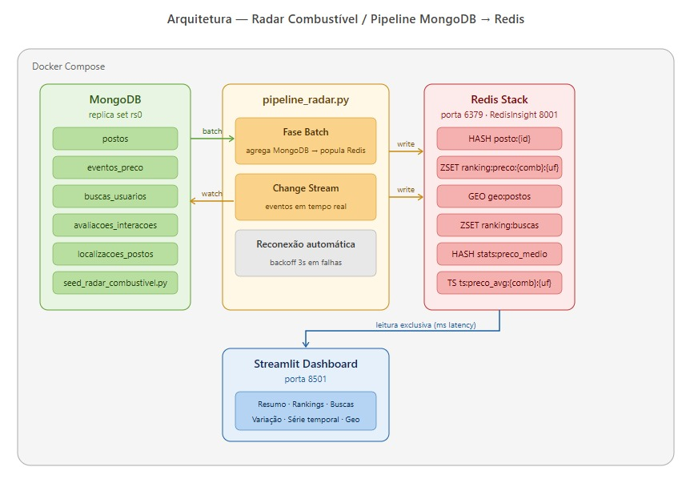
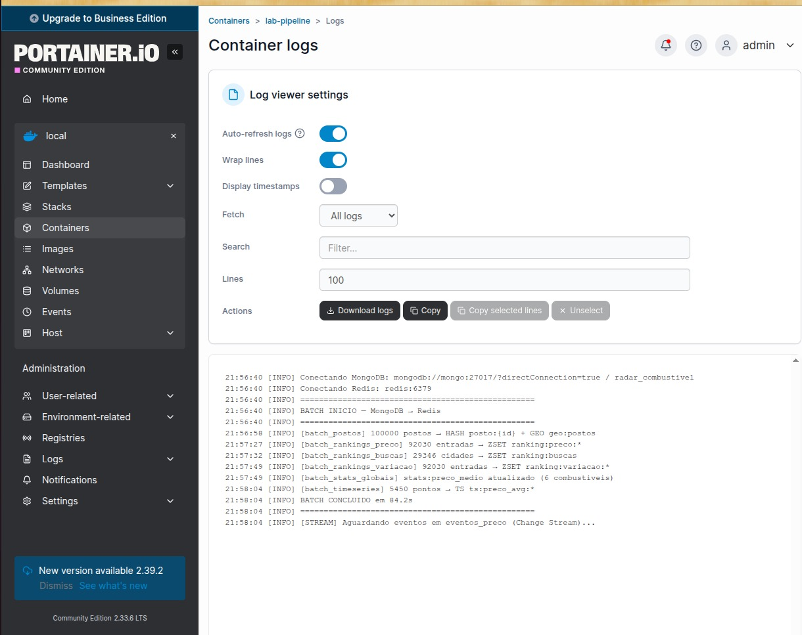
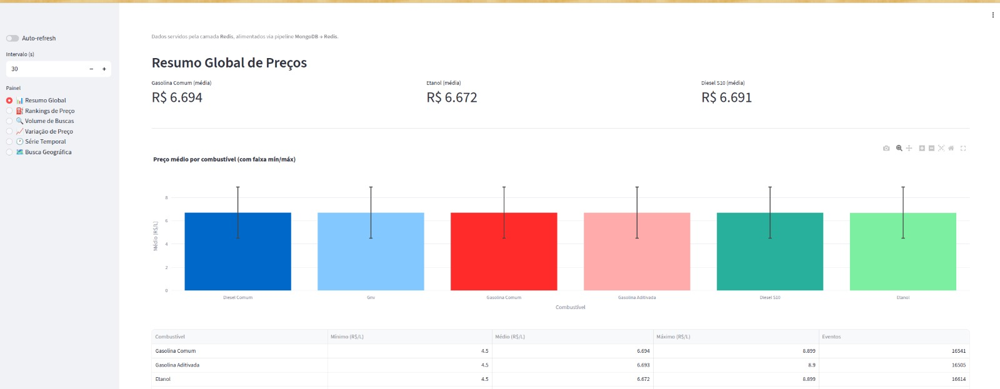
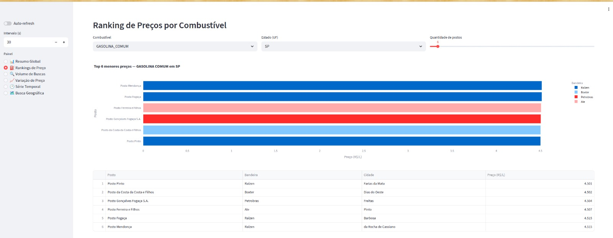
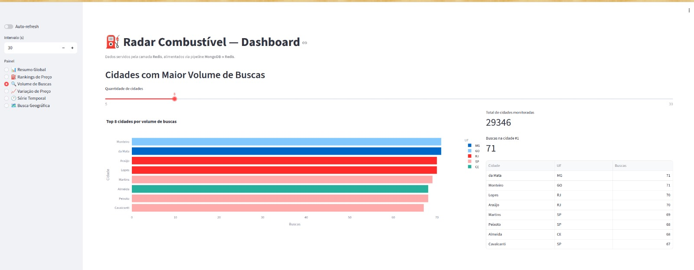
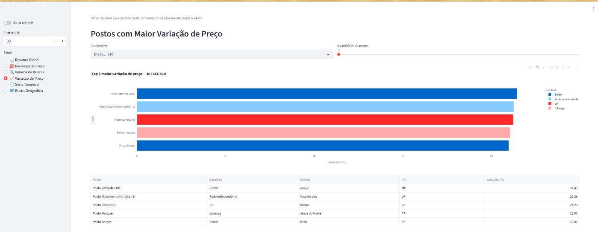
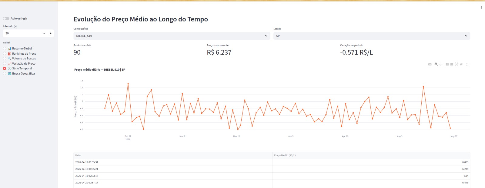
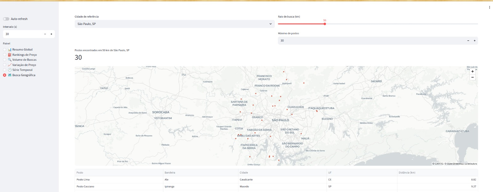

# Pipeline MongoDB → Redis — Radar Combustível

Trabalho final da disciplina IMDB — FIAP Engenharia de Dados.

Pipeline de dados em tempo quase real usando **MongoDB como fonte de eventos** e **Redis como camada de serving**, aplicado ao caso da plataforma **Radar Combustível**.

## Arquitetura



## Estrutura do projeto

```
├── app/                    # Dashboard Streamlit
│   └── dashboard.py
├── docker/                 # Imagem Docker do projeto
│   └── Dockerfile
├── pipeline/               # Pipeline MongoDB → Redis
│   └── pipeline_radar.py
├── seed/                   # Geração de dados no MongoDB
│   └── seed_radar_combustivel.py
├── docs/                   # Prints e diagrama
├── docker-compose.yml
├── pyproject.toml
└── .env.example
```

## Pré-requisitos

- [Docker](https://www.docker.com/) + Docker Compose
- Ou [uv](https://github.com/astral-sh/uv) para rodar localmente

## Como rodar

### 1. Subir os containers

```bash
docker compose up -d
```

O Compose orquestra tudo automaticamente na seguinte ordem:

| Etapa | Container | Ação |
|---|---|---|
| 1 | `lab-mongo` | Sobe MongoDB e aguarda ficar healthy |
| 2 | `lab-mongo-init` | Inicializa o replica set `rs0` |
| 3 | `lab-seed` | Popula 500 mil documentos no MongoDB (skip se já existir) |
| 4 | `lab-pipeline` | Executa batch → Redis e inicia Change Stream |
| 4 | `lab-redis` | Sobe Redis Stack em paralelo com o seed |
| 5 | `lab-streamlit` | Inicia o dashboard após seed concluído |

O pipeline (batch) leva ~2 minutos. O Streamlit estará disponível em `:8501` enquanto isso, e exibirá os dados assim que o pipeline concluir.

### 2. Acessar o dashboard

```
http://localhost:8501
```

| Container | Porta | Descrição |
|---|---|---|
| `lab-mongo` | 27017 | MongoDB 7 com replica set `rs0` |
| `lab-redis` | 6379 / 8001 | Redis Stack (RedisInsight em :8001) |
| `lab-pipeline` | — | Batch + Change Stream contínuo |
| `lab-streamlit` | 8501 | Dashboard Streamlit |

## Pipeline em execução



## Estruturas Redis geradas

| Chave | Tipo | Conteúdo |
|---|---|---|
| `posto:{id}` | HASH | Cadastro resumido do posto |
| `geo:postos` | GEO | Coordenadas de todos os postos |
| `ranking:preco:{comb}:{uf}` | ZSET | Menor preço por combustível/estado |
| `ranking:buscas` | ZSET | Cidades com mais buscas |
| `ranking:variacao:{comb}` | ZSET | Maior variação de preço |
| `stats:preco_medio` | HASH | Min/avg/max por combustível |
| `ts:preco_avg:{comb}:{uf}` | Time Series | Preço médio diário |

## Dashboard

### Resumo Global


### Rankings de Preço


### Volume de Buscas


### Variação de Preço


### Evolução de Preço (Série Temporal)


### Busca Geográfica


## Consultas Redis de demonstração

```bash
docker compose exec redis redis-cli

ZRANGE ranking:preco:GASOLINA_COMUM:SP 0 9 WITHSCORES
ZREVRANGE ranking:buscas 0 9 WITHSCORES
HGETALL stats:preco_medio
GEOSEARCH geo:postos FROMLONLAT -46.6333 -23.5505 BYRADIUS 50 km ASC COUNT 10
TS.RANGE ts:preco_avg:GASOLINA_COMUM:SP - +
```

## MongoDB Compass

```
mongodb://localhost:27017/?directConnection=true
```

## Rodar com uv (local)

```bash
uv sync
REDIS_HOST=localhost uv run streamlit run app/dashboard.py
MONGO_URI=mongodb://localhost:27017/?directConnection=true uv run python pipeline/pipeline_radar.py
```

## Recomeçar do zero

```bash
docker compose down -v && docker compose up -d
```
